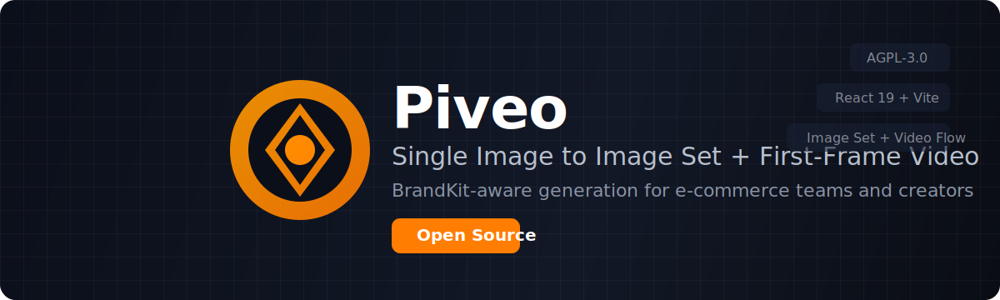
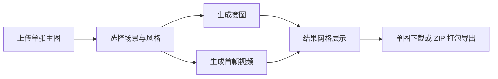

<p align="center">
  
</p>

<h1 align="center">Piveo</h1>
<p align="center"><strong>Single Image In. Image Set + First-Frame Video Out.</strong></p>

<p align="center">
  <a href="https://github.com/JamesbbBriz/Piveo"></a>
  <a href="./LICENSE"></a>
  
  
  
</p>

<p align="center">
  <a href="#english">English</a> | <a href="#中文">中文</a>
</p>

---

<a id="english"></a>
## English

Piveo is an AI creative workstation for e-commerce and creators.
It turns one source image into a multi-style image set and a short first-frame-driven video, with BrandKit-aware consistency.

## Highlights

- Single-flow generation: upload one image, choose styles, generate image set + video.
- BrandKit-aware output: keep visual identity constraints across assets.
- Built-in auth + API proxy server for safer upstream key handling.
- Batch and gallery workflows for fast review, download, and reuse.
- Open-source governance with AGPL-3.0, contribution and security policies.

## Quick Start

### Requirements

- Node.js 20+
- npm 10+

### Run locally

```bash
npm install
cp .env.example .env.local
npm run dev
```

App services:

- Web: `http://localhost:3000`
- Auth/API server: `http://localhost:3101`

## Environment Variables

Use `.env.local` (based on `.env.example`):

| Variable | Description |
| --- | --- |
| `UPSTREAM_AUTHORIZATION` | Server-side auth header for upstream gateway |
| `UPSTREAM_API_BASE_URL` | Upstream API base URL (default: `https://n.lconai.com`) |
| `VITE_API_BASE_URL` | Frontend API base URL (recommended: `/api`) |
| `VITE_DEFAULT_IMAGE_MODEL` | Default image model |
| `AUTH_USER` / `AUTH_PASSWORD` | Local login account |
| `AUTH_JWT_SECRET` | JWT signing secret |

## Scripts

```bash
npm run dev        # web + auth server
npm run dev:web    # web only
npm run dev:auth   # auth/api server only
npm run build      # production build
npm run start      # production server
npm test           # run tests
```

## System Overview


## Tech Stack

- Frontend: React 19 + TypeScript + Vite
- Server: Express (auth + API proxy)
- Storage: IndexedDB with local fallback
- Media pipeline: image/video orchestration services

## Governance

- License: [AGPL-3.0-or-later](./LICENSE)
- Contributing: [CONTRIBUTING.md](./CONTRIBUTING.md)
- Governance model: [GOVERNANCE.md](./GOVERNANCE.md)
- Code of conduct: [CODE_OF_CONDUCT.md](./CODE_OF_CONDUCT.md)
- Security policy: [SECURITY.md](./SECURITY.md)

## Acknowledgement

README structure inspiration: [openclaw/openclaw](https://github.com/openclaw/openclaw).

---

<a id="中文"></a>
## 中文

Piveo 是一个面向电商与内容创作者的 AI 创作工作台。
它可以把一张主图快速生成成套图片和首帧驱动短视频，并通过 BrandKit 约束保持品牌一致性。

## 核心能力

- 单一路径生成：上传一张图，选择风格，一键生成套图 + 视频。
- BrandKit 约束：统一品牌视觉规则，减少返工。
- 内置鉴权与代理：上游密钥仅在服务端配置，前端不暴露。
- 支持批量与图库流：快速筛选、复用、下载与打包。
- 完整开源治理：AGPL 协议、贡献规范、安全策略齐备。

## 本地启动

### 环境要求

- Node.js 20+
- npm 10+

### 启动步骤

```bash
npm install
cp .env.example .env.local
npm run dev
```

默认服务地址：

- 前端：`http://localhost:3000`
- 鉴权/API：`http://localhost:3101`

## 关键环境变量

请在 `.env.local` 中配置（可参考 `.env.example`）：

| 变量 | 说明 |
| --- | --- |
| `UPSTREAM_AUTHORIZATION` | 服务端访问上游网关的鉴权头 |
| `UPSTREAM_API_BASE_URL` | 上游 API 地址（默认 `https://n.lconai.com`） |
| `VITE_API_BASE_URL` | 前端请求地址（建议 `/api`） |
| `VITE_DEFAULT_IMAGE_MODEL` | 默认生图模型 |
| `AUTH_USER` / `AUTH_PASSWORD` | 本地登录账号 |
| `AUTH_JWT_SECRET` | JWT 签名密钥 |

## 常用命令

```bash
npm run dev        # 同时启动前端和鉴权服务
npm run dev:web    # 仅启动前端
npm run dev:auth   # 仅启动鉴权/API 服务
npm run build      # 生产构建
npm run start      # 生产运行
npm test           # 测试
```

## 系统概览



## 开源与社区

- 协议：[LICENSE](./LICENSE)
- 贡献：[CONTRIBUTING.md](./CONTRIBUTING.md)
- 治理：[GOVERNANCE.md](./GOVERNANCE.md)
- 行为准则：[CODE_OF_CONDUCT.md](./CODE_OF_CONDUCT.md)
- 安全策略：[SECURITY.md](./SECURITY.md)
